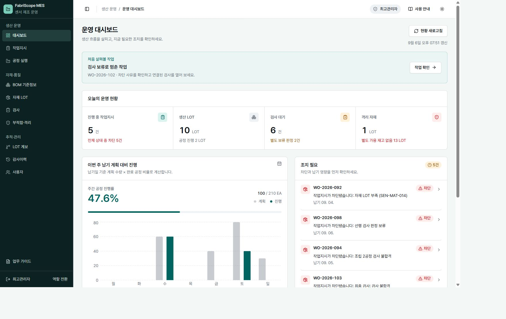

# FabriScope MES

> React 업무 화면에서 시작해 생산·자재·검사의 상태와 수량을 PostgreSQL까지 연결한 센서 제조 MES 포트폴리오

생산 자동화 현장 경험과 React 개발 경험을 연결한 **개인 프로젝트**입니다. 가상의 센서 제조를 대상으로 “자재가 부족하거나 검사가 불합격이면 다음 공정을 실행할 수 있는가?”를 화면·API·데이터 모델에 같은 규칙으로 구현했습니다.

| 항목 | 내용 |
| --- | --- |
| 구현 범위 | 업무 화면과 공용 UI, 역할별 접근 제어, NestJS API, Prisma 모델·트랜잭션, 회귀 검증, 개발 문서 |
| 저장소 개발 기록 | 2026-08-31부터 진행 중 — Git 기록 기준이며 실제 전체 개발 기간과 구분 |
| 현재 시연 | [공개 데모](https://fabriscope.pages.dev/login) · [로컬 데모](http://localhost:5173/login) |
| 데이터 | 제품·공정·검사 기준·계정 모두 가상 데이터 |



## 먼저 볼 흐름

로그인에서 **데모 둘러보기**를 누르면 대시보드로 진입합니다. 로그인 안내와 이어지는 **처음 살펴볼 작업 → 작업 확인**으로 시작하세요. 별도 소개 페이지나 자동 팝업 없이 실제 업무 화면을 따라갑니다.

1. **보류된 작업지시**: 차단 사유와 멈춘 후속 공정을 확인합니다.
2. **작업지시의 검사 → 보류 검사 상세**: 최초 판정 사유와 담당자·시간을 확인합니다. 보류 검토는 품질 담당자와 최고관리자가 수행할 수 있습니다.
3. **보류 검토 후 완료 사례**: 최초 보류와 합격 검토 이력이 모두 남는지 확인합니다. 현재 보류 작업이 없으면 대시보드 시작점은 이 사례로 연결합니다.

대표 사례는 `db:demo`로 생성합니다. 기존 데이터를 재설정하지 않고, 다음 네 작업을 실제 업무 명령으로 실행합니다. 입고 재고와 기준정보는 가상 fixture입니다.

| 사례 | 확인할 내용 |
| --- | --- |
| 정상 완료 | 12개 투입 → 절단 양품 11·불량 1 → 후속 공정 11개 승계 → 필수 검사 합격 |
| 검사 보류 | 조립 검사 HOLD → 후속 공정 차단 |
| 불합격 차단 | 조립 검사 FAIL → 후속 공정 차단 |
| 보류 검토 후 완료 | 최초 HOLD 보존 → 근거를 남긴 PASS 검토 → 후속 공정·최종 검사 완료 |

로그인에는 전체 업무용 최고관리자와 네 가지 담당자 계정이 모두 표시됩니다. **담당 업무별로 접속**에서 각 역할의 업무 설명과 시작 화면을 비교하고 바로 접속할 수 있습니다.

새 작업지시는 다음 흐름으로 실행할 수 있습니다. 세 제품의 전체 흐름은 실제 PostgreSQL 회귀 테스트로도 검증합니다.

```text
초안 생성 → 발행(BOM·검사규격 스냅샷, 공정·LOT·검사 생성)
          → 자재 예약 → 공정 시작(예약 자재 소비)
          → 공정 완료(양품 + 불량 = 투입 수량)
          → 필요한 검사 합격 → 다음 공정(선행 양품 수량 승계)
          → 모든 공정 완료 + 필수 검사 합격 → 작업지시 완료
```

[로그인 화면](docs/assets/login.png) · [작업지시 상세 화면](docs/assets/work-order.png) · [5분 시연과 검증 범위](docs/engineering/testing-and-demo.md)

## 구현에서 집중한 문제

| 문제 | 구현과 선택 이유 | 확인할 코드·근거 |
| --- | --- | --- |
| 복잡한 목록을 이동·재조회해도 맥락 유지 | 조회 조건은 URL에, 입력 중 상태는 화면에 둡니다. 같은 GET 공유와 취소로 늦은 응답의 덮어쓰기를 막습니다. | [프런트엔드 구조](docs/engineering/frontend-architecture.md), [API 요청 규칙](docs/engineering/frontend-api-request-rules.md) |
| 화면의 버튼과 서버의 실행 조건 불일치 | 역할·상태·수량은 API에서 다시 검증합니다. 검사 판정 후 후속 공정과 작업지시 상태를 함께 재계산합니다. | [생산 상태 전이](apps/api/src/process-executions/production-flow.ts), [회귀 테스트](apps/api/test/production-flow.spec.ts) |
| 발행 후 기준정보가 바뀌는 문제 | 발행 시 BOM 소요량과 검사규격을 작업지시에 스냅샷으로 남깁니다. | [작업지시 서비스](apps/api/src/work-orders/work-orders.service.ts) |
| 취소 중 일부 데이터만 저장되는 문제 | 취소·예약 해제·미완료 검사 취소·감사 기록을 하나의 트랜잭션으로 처리합니다. 긴 사유는 원문을 보존하고 목록 요약만 제한합니다. | [취소 실패 회귀](apps/api/test/work-order-commands.e2e-spec.ts), [실제 DB 검증](apps/api/test/production-flow.postgres.spec.ts) |
| 지표가 실제보다 좋아 보이는 문제 | 주간 집계는 서울 시간 월~일, 공정 진행률은 납기별 계획 수량에 완료 공정 비율을 반영합니다. 검사 대기와 보류 판정은 별도 집계입니다. | [대시보드 집계](apps/api/src/dashboard/dashboard.service.ts), [요일 경계 테스트](apps/api/test/dashboard-calendar.spec.ts) |

## 구현 범위와 남은 일

| 상태 | 범위 |
| --- | --- |
| 구현 | 역할별 로그인·접근 제어, 작업지시 생성·발행·취소, BOM 예약·소비, 공정 시작·완료, 검사 판정·보류 검토와 후속 차단, 기준정보, 사용자 권한 관리, 감사이력 |
| 구현 | 자재 LOT 품질 상태 변경·원천 자재 격리, 부적합 등록, LOT 직접 연결 조회, 서버 집계 대시보드, 업무 가이드 |
| 제한 | 기존 시연 데이터에는 일부 공정 이력만 담겨 있습니다. 신규 발행은 제품별 전체 공정과 검사를 생성합니다. 주간 진행률은 공정 완료 비율이며 생산 양품 실적 지표는 별도 확장이 필요합니다. |
| 계획 | 출하 승인, 영향 LOT 전체의 재귀 추적·일괄 격리, 분할·병합 실행, 일반 판정 정정·재작업 흐름, 운영 부하 검증 |

LOT 계보의 분할·병합 예시는 조회용 시드입니다. 실제 설비 연동이나 제조 현장 운영 성과를 주장하지 않습니다. 상세 목표는 [제품 비전](docs/product/vision.md), 구현 규칙은 [제조 도메인 계약](docs/domain/manufacturing-domain-contract.md)에서 확인할 수 있습니다.

## 기술 구성

- Web: React, TypeScript, Vite, TanStack Router, Tailwind CSS, Radix UI
- API·Data: NestJS, REST API, PostgreSQL, Prisma
- 검증·실행: Vitest, Testing Library, Supertest, ESLint, Docker Compose, GitHub Actions

기술 선택의 대안과 이유는 [ADR-0003](docs/adr/0003-full-stack-foundation.md)에 기록했습니다.

## 로컬 실행

Node.js 24 LTS(저장소 기준 `.node-version`), pnpm 11.25.0, Docker Compose가 필요합니다. 아래는 **새 로컬 DB**를 준비하는 PowerShell 명령입니다.

```powershell
Copy-Item .env.example .env
Copy-Item .env.example apps/api/.env
corepack pnpm install --frozen-lockfile
corepack pnpm db:up
corepack pnpm db:check
corepack pnpm db:migrate:deploy
corepack pnpm db:seed
corepack pnpm db:verify-auth
corepack pnpm --filter @sensor-mes/api db:demo
corepack pnpm dev
```

이미 `.env`가 있으면 유지합니다. 기존 DB에 seed를 다시 실행하면 시연 예약·감사 기록을 재작성하므로 새 시연 DB에서만 초기화합니다. 커스텀 PostgreSQL 포트는 루트와 `apps/api/.env`의 `DATABASE_URL`을 맞춥니다.

- Web: <http://localhost:5173>
- API health: <http://localhost:3000/api/health>
- 기본 PostgreSQL: `localhost:5432`

Vite는 `/api` 요청을 NestJS로 proxy합니다. 환경변수 예시는 [`.env.example`](.env.example)에 있으며 `.env`와 비밀값은 commit하지 않습니다.

## 검증

```bash
corepack pnpm check
corepack pnpm test:postgres
```

check는 lint·typecheck·일반 테스트·build·문서 검사를 실행합니다. test:postgres는 세 제품의 생산·보류 검토 흐름과 예약된 작업지시 취소를 검사하고 롤백합니다. 별도 검토 동시성 테스트는 전용 임시 작업을 생성해 경쟁 요청과 감사 실패 시 원자성을 확인한 뒤 해당 기록만 정리합니다. CI도 PostgreSQL 기동·migration·seed 뒤 이 검사를 별도로 실행하도록 구성했습니다.

HTTP 테스트 일부는 대체 Prisma를 사용합니다. 실제 DB 통합 테스트와 브라우저 확인의 범위는 [검증 방법](docs/engineering/testing-and-demo.md)에 구분했습니다. 보류 검토의 두 경쟁 요청은 확인했지만, 이 결과로 전체 명령의 동시성이나 운영 부하 성능을 주장하지 않습니다.

## 문서

[문서 길잡이](docs/README.md) · [개발 문서 지도](docs/engineering/README.md) · [업무 안내](docs/product/operations-guide.md) · [화면 규칙](docs/engineering/frontend-design-system.md) · [개발 절차](CONTRIBUTING.md)

로그인 후 **안내 → 업무 가이드**에서도 같은 문서를 읽을 수 있습니다.

이 프로젝트는 특정 회사의 내부 MES를 복제하지 않습니다. 회사 로고·고객·실제 공정조건·품질 기준·운영 데이터는 사용하지 않습니다.

## License

[MIT](LICENSE)
